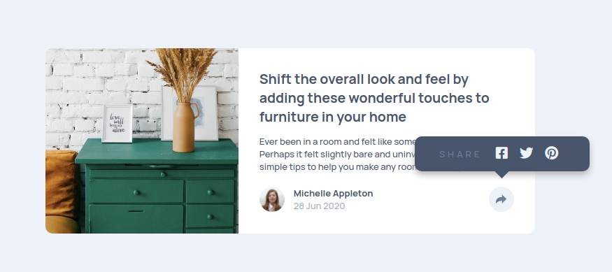

# Frontend Mentor - Article Preview Component

Article preview component design from the website Frontend Mentor.
https://www.frontendmentor.io/challenges/article-preview-component-dYBN_pYFT

Well I used flex for mobile version, grid for desktop version and some js for the button. I have good comments that helps you understand the logic behind.

This is the preview I made:

Live: https://billgeorgop93.github.io/Article-Preview/
